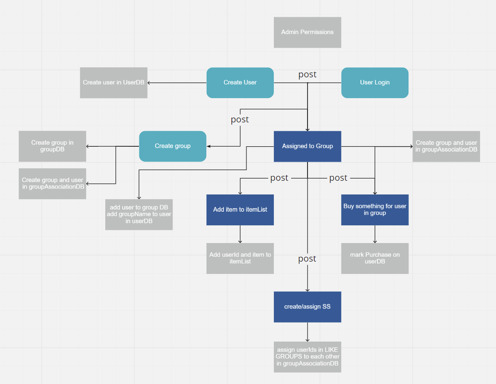
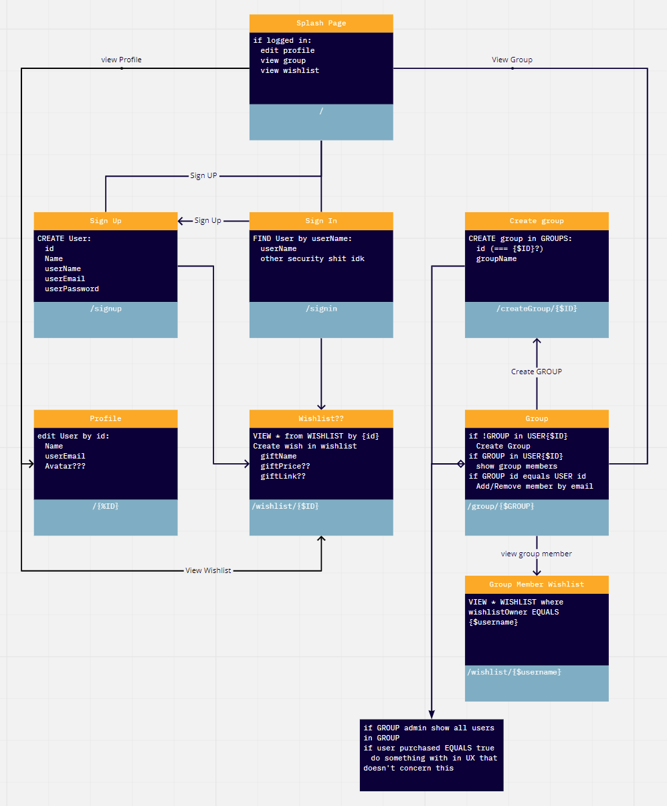

# Treat Your Elves

Authors: George Mead, Katy Roffe, Barrett Nance, Sarah Creager, Justin Hamerly

Deployed Server: [Heroku](https://treat-your-elves.herokuapp.com/)\
Whiteboard: [Miro](https://miro.com/app/board/o9J_lvo8BLg=/) \
Project Management: [GitHub Projects](https://github.com/401-Midterm-Project-Org/planning-docs/projects/1)

---

## Installation

`npm install`

* base-64
* bcrypt
* cors
* dotenv
* express
* jest
* jsonwebtoken
* pg
* morgan
* sequelize
* sequelize-cli
* sqlite3
* supertest

```plaintext
SAMPLE ENV

PORT=3001

DATABASE_URL=sqlite:memory

SECRET=secretstring
```

## About

Treat Your Elves is an application to simplify the secret santa process.  This app allows a group or an organization to create members, allow those members to create wishlists, and randomly assigns each member a secret santa.  

---

## Problem Domain

_Treat Your Elves_  alleviates the stress of planning and organizing a Secret Santa gift exchange! It does all the work for you, randomly assigning each member a Secret Santa within the group and granting them visibility to that user's wishlist. No more accidentally finding out who your Secret Santa is or wondering what in the world you are going to buy for your person! Cozy up and spend your time enjoying the holidays, while we simplify the process for you!

_Treat Your Elves_ utilizes a PostreSQL database to secure client data and ACL middleware to ensure no sneaky little elves can alter user groups or wishlists without proper permissions as assigned by the group admin.

---

## MVP

* Models for `users` and `groups`
  * Database association between the `group` and `user`
  * Users assigned a role of either `admin` or `user`
* Users will have a wishlist
* Authentication & Authorization
  * Requires users to be logged into app to make any changes
  * Limits the user to specific permissions on CRUD routes based on assigned role
* Global: Ability to create users and user roles
* Admins: Ability to create/read/update/delete groups and wishlists
* Users: Ability to create/update/delete personal wishlists and read other group user wishlists
* Ability to assign a secret santa to user / randomizing function

---

## User Stories

### WISHLIST

As a group member I want to be able to add items to my wishlist for my secret santa to view  

*Feature Tasks:*  

* User can add an item to their wishlist
* All users in the group will be able to view all user wishlist

*Acceptance:*

* When the user searches for an item, they can click an add button, and the item will be added to their wishlist in a database  
* When a group member is logged in they will see the wishlist of their secret gift recipient

### CREATE A GROUP

As a group administrator I want to be able to add my group members to the secret santa event

*Feature tasks:*

* Admin can create a group and add users to the group
* Admin has privileges to add and remove members  
* Users cannot add members/can request invitation for new members

*Acceptance:*

* The admin has an interface for adding and removing members
* When members are added or removed, the group member list will update
* Users have a request button, and when they request an add to the group, the admin will receive a request to approve or deny the request

### SECRET SANTA ASSIGNMENT

As a group admin, I want to be able to randomly assign everyone in the group a unique member of the group as their secret santa

*Feature tasks:*

* Each member of the group is assigned a unique secret santa
* There are no duplicate secret santas
* You will not be assigned yourself as your secret santa

*Acceptance:*

* Group members will each be assigned a random secret santa using an array
  * This will ensure that each member is tied to another unique member
  * The member on the end of the linked list will be linked to index[0] of the array

### PERSISTING DATABASE

As a secret santa, I want to be able to revisit the app to view any updates or changes made to my assigned partner

*Feature Tasks:*

* Wishlists will be stored on a PostreSQL database
* The database can receive CRUD requests to make changes and view wishlists

*Acceptance:*

* When doing CRUD requests, the PostreSQL database will reflect the changes
* Status messages will be sent back upon successful/unsuccessful database requests

### SECURITY

As an app user, I want to be able to log into my app and keep my data secure

*Feature Tasks:*

* Authentication and authorization for group members and administrators
  * User roles and capabilities to define appropriate CRUD capabilities

*Acceptance:*

* An admin will be able to do all CRUD methods when it comes to managing the users in the group
  * A user will only be able to view other members and update their own wishlists

---

### UMLS





## Resources

### Sites

* [Fisher-Yates Shuffle](https://bost.ocks.org/mike/shuffle/)
* [Stack Overflow](stackoverflow.com)
* [Sequelize Docs](https://sequelize.org/master/)
* [MDN Docs](https://developer.mozilla.org/en-US/)
* [W3 Schools](https://www.w3schools.com/)
* [Node JS Docs](https://nodejs.org/en/docs/)

### Advisors

* Jacob Knaack
* Audrey Patterson
